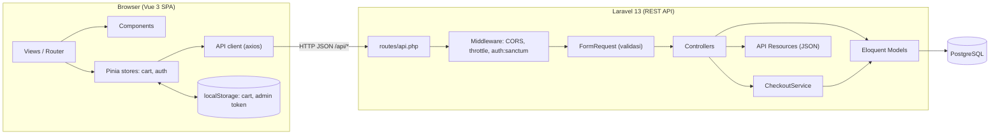
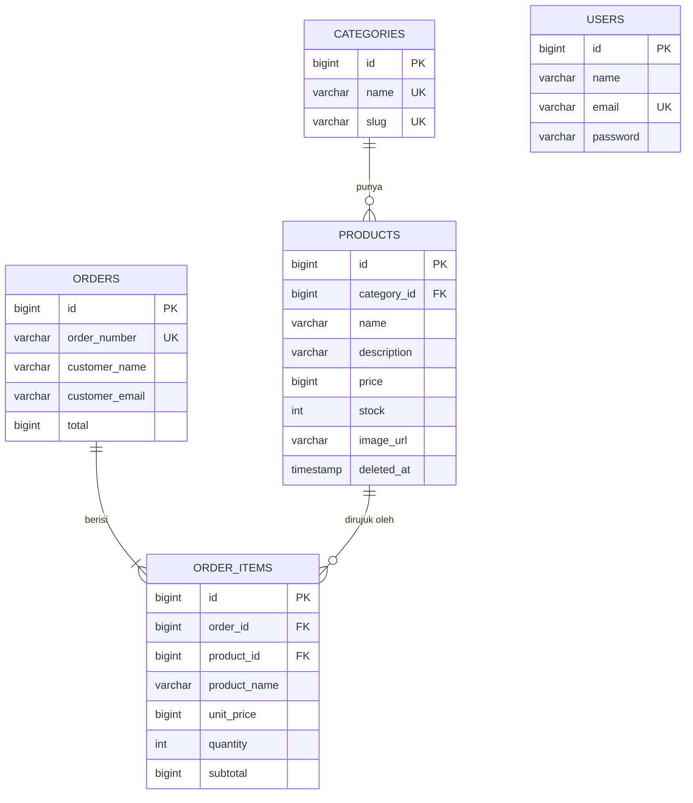
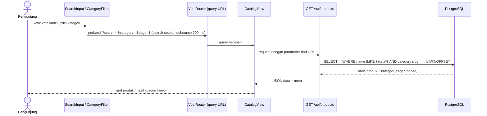
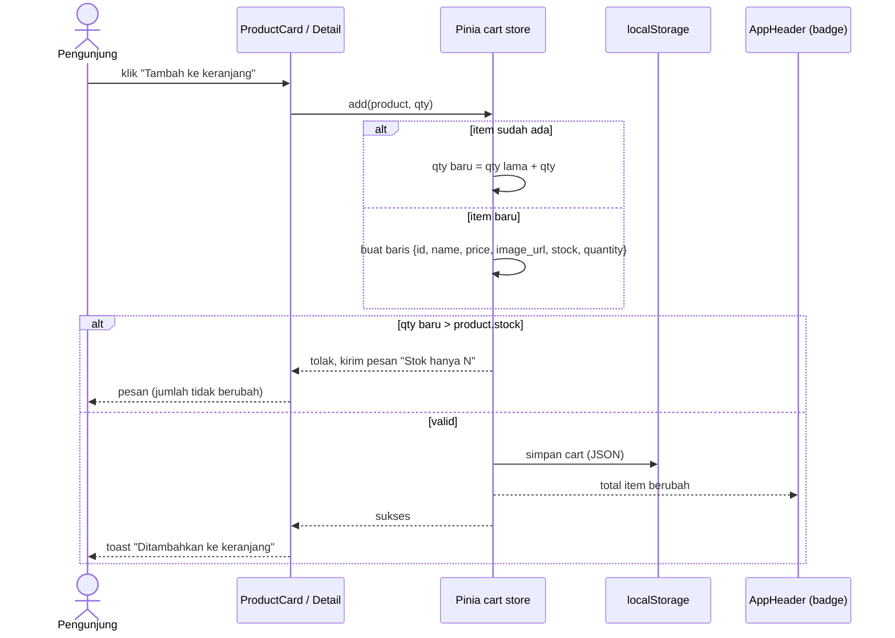
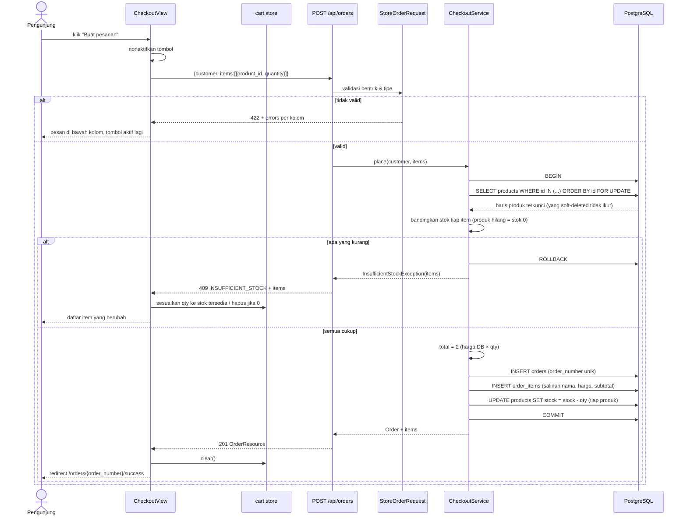
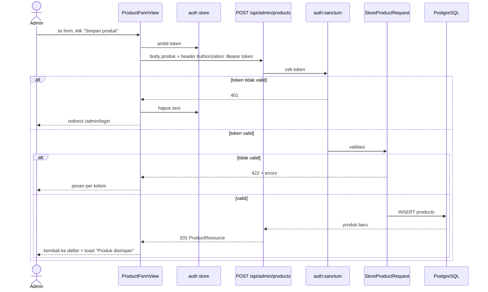
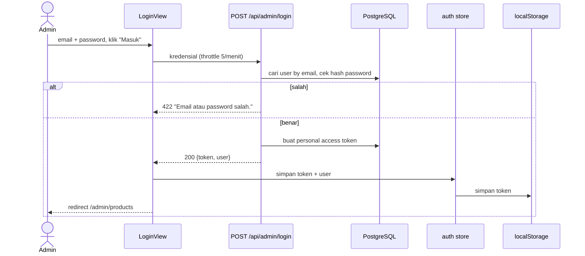

# Design — MiniShop

> Menjawab **BAGAIMANA** requirement di `requirement.md` diwujudkan. Tampilan visual ada di `ui.md`.
> Bila ada konflik: `requirement.md` menang atas file ini. Ubah spec dulu, baru kode.

## 1. Arsitektur

### 1.1 Gambaran komponen



### 1.2 Tanggung jawab

| Komponen | Tanggung jawab | Bukan tanggung jawabnya |
|---|---|---|
| Vue Views | Halaman per route, menyusun komponen, memanggil API | Aturan bisnis stok/harga |
| Pinia `cart` | Isi keranjang, hitung subtotal/total tampilan, sinkron `localStorage` | Sumber kebenaran harga & stok |
| Pinia `auth` | Token admin, status login | Otorisasi (dilakukan server) |
| API client | Base URL, header token, interceptor 401, normalisasi error | Logika tampilan |
| FormRequest | Validasi bentuk & tipe input | Cek stok (butuh kunci database) |
| Controller | Menerima request, memanggil model/service, mengembalikan Resource | Logika transaksi |
| `CheckoutService` | Satu transaksi: kunci baris produk, cek stok, buat order, kurangi stok | Format response |
| API Resource | Bentuk JSON yang stabil | Query |
| PostgreSQL | Penyimpan data + constraint pengaman | — |

### 1.3 Keputusan teknis

| Keputusan | Pilihan | Alasan singkat (untuk README) |
|---|---|---|
| Backend | Laravel 13, REST API | Sesuai case study; validasi, ORM, migration, seeder bawaan |
| Database | PostgreSQL | Transaksi + row lock andal untuk stok; `ILIKE` untuk pencarian; *check constraint* |
| Auth admin | Laravel Sanctum (personal access token), akun dari seeder `[Asumsi]` | Admin CRUD tidak boleh terbuka publik; Sanctum ringan tanpa OAuth |
| Frontend | Vue 3 + Vite + Vue Router + Pinia | Sesuai pilihan; Pinia cocok untuk cart + persist |
| Styling | Tailwind CSS v4 + CSS variables token dari `ui.md` `[Asumsi]` | Cepat, konsisten dengan token; boleh diganti CSS biasa selama token sama |
| HTTP client | axios | Interceptor 401 & error sederhana |
| Harga | `bigint` Rupiah (bukan float) | Tanpa galat pembulatan |
| Cart | Klien saja, persist `localStorage` | Sesuai case study; server baru tahu saat checkout |
| Transisi Grid | `<TransitionGroup>` Vue 3 (FLIP `v-move`) | Animasi pergeseran posisi mulus saat filter/search tanpa pustaka eksternal |
| Debounce Search | 250 ms sisi klien | Mencegah layout thrashing dan request berlebihan saat mengetik cepat |
| Hapus produk | Soft delete | Order lama tetap valid |
| Cache | Tidak ada | Stok/harga harus selalu terbaru (REQ-ADM-06) |

### 1.4 Struktur folder

```
minishop/
├── specs/                       # requirement.md, design.md, task.md, ui.md
├── backend/                     # Laravel 13
│   ├── app/
│   │   ├── Exceptions/InsufficientStockException.php
│   │   ├── Http/
│   │   │   ├── Controllers/Api/{CategoryController,ProductController,OrderController}.php
│   │   │   ├── Controllers/Api/Admin/{AuthController,ProductController,OrderController}.php
│   │   │   ├── Requests/{StoreOrderRequest,LoginRequest}.php
│   │   │   ├── Requests/Admin/{StoreProductRequest,UpdateProductRequest}.php
│   │   │   └── Resources/{CategoryResource,ProductResource,OrderResource,OrderItemResource}.php
│   │   ├── Models/{User,Category,Product,Order,OrderItem}.php
│   │   └── Services/CheckoutService.php
│   ├── database/{migrations,factories,seeders}/
│   ├── routes/api.php
│   └── tests/Feature/{CatalogTest,CheckoutTest,AdminProductTest}.php
└── frontend/                    # Vue 3 (Vite)
    └── src/
        ├── api/{http,catalog,orders,admin}.js
        ├── stores/{cart,auth}.js
        ├── router/index.js
        ├── views/{CatalogView,ProductDetailView,CartView,CheckoutView,OrderSuccessView,NotFoundView}.vue
        ├── views/admin/{LoginView,ProductListView,ProductFormView,OrderListView,OrderDetailView}.vue
        ├── components/{AppHeader,ProductCard,ProductGrid,SearchInput,CategoryFilter,QuantityStepper,
        │               CartLine,CartSummary,Pagination,StockBadge,PriceText,ConfirmDialog,
        │               EmptyState,ErrorState,SkeletonCard,Toast,FloatingCartButton,AdminLayout}.vue
        ├── composables/useDebounce.js
        ├── utils/{format,storage}.js
        └── assets/styles.css    # token dari ui.md
```

### 1.5 Route frontend

| Path | View | Akses |
|---|---|---|
| `/` | CatalogView (query: `q`, `category`, `page`) | Publik |
| `/products/:id` | ProductDetailView | Publik |
| `/cart` | CartView | Publik |
| `/checkout` | CheckoutView | Publik |
| `/orders/:orderNumber/success` | OrderSuccessView | Publik |
| `/admin/login` | Admin LoginView | Publik |
| `/admin/products` | ProductListView | Admin |
| `/admin/products/new`, `/admin/products/:id/edit` | ProductFormView | Admin |
| `/admin/orders`, `/admin/orders/:id` | OrderListView, OrderDetailView | Admin |
| `*` | NotFoundView | Publik |

---

## 2. Data Model

### 2.1 ERD



### 2.2 Tabel dan kolom

**`categories`**

| Kolom | Tipe | Aturan |
|---|---|---|
| id | bigserial | PK |
| name | varchar(100) | unique, not null |
| slug | varchar(120) | unique, not null (dipakai di query `?category=`) |
| created_at, updated_at | timestamp | |

**`products`**

| Kolom | Tipe | Aturan |
|---|---|---|
| id | bigserial | PK |
| category_id | bigint | FK → categories.id, `restrictOnDelete`, index |
| name | varchar(150) | not null |
| description | varchar(500) | not null, default '' (deskripsi singkat) |
| price | bigint unsigned | not null, **CHECK (price >= 0)** — Rupiah utuh |
| stock | integer | not null, default 0, **CHECK (stock >= 0)** |
| image_url | varchar(2048) | nullable |
| deleted_at | timestamp | nullable (soft delete) |
| created_at, updated_at | timestamp | |

**`orders`**

| Kolom | Tipe | Aturan |
|---|---|---|
| id | bigserial | PK |
| order_number | varchar(20) | unique, format `MS-YYMMDD-XXXXXX` (6 karakter acak A–Z0–9 tanpa ambigu) |
| customer_name | varchar(100) | not null |
| customer_email | varchar(150) | not null |
| total | bigint unsigned | not null, = jumlah semua `subtotal` |
| created_at, updated_at | timestamp | index pada `created_at` untuk urutan terbaru |

**`order_items`** (salinan data saat order dibuat)

| Kolom | Tipe | Aturan |
|---|---|---|
| id | bigserial | PK |
| order_id | bigint | FK → orders.id, `cascadeOnDelete`, index |
| product_id | bigint | FK → products.id, `restrictOnDelete` (aman karena produk soft delete) |
| product_name | varchar(150) | salinan nama saat order |
| unit_price | bigint unsigned | salinan harga saat order |
| quantity | integer | not null, **CHECK (quantity >= 1)** |
| subtotal | bigint unsigned | = unit_price × quantity |
| — | — | **UNIQUE (order_id, product_id)** |

**`users`** — bawaan Laravel (id, name, email unique, password, timestamps). Semua user adalah admin; tidak ada tabel peran karena hanya ada satu jenis akun. Tabel `personal_access_tokens` dari Sanctum.

### 2.3 Catatan data

- Index pencarian: `ILIKE '%kata%'` pada 10–ratusan produk cukup tanpa index khusus. Bila data membesar, tambah `pg_trgm` + GIN index (dicatat sebagai *Known limitation*).
- Karakter `%`, `_`, `\` pada input pencarian di-*escape* sebelum masuk `ILIKE`.
- *Check constraint* dibuat lewat `DB::statement('ALTER TABLE ... ADD CONSTRAINT ...')` di migration (Blueprint Laravel tidak menyediakannya).
- Seeder: 4 kategori (contoh: Tanaman, Pot & Wadah, Perlengkapan Taman, Dekorasi Rumah), 10 produk (harga bervariasi, ≥ 1 stok 0, ≥ 1 stok ≤ 5), 1 admin `admin@minishop.test` / `password` (**hanya untuk pengembangan lokal**, ditulis di README).

---

## 3. Kontrak API

Base URL: `{BACKEND}/api`. Semua respons JSON. Kunci JSON memakai `snake_case`.

### 3.1 Endpoint

| Method | Path | Auth | Fungsi | Sukses |
|---|---|---|---|---|
| GET | `/categories` | — | Daftar kategori | 200 |
| GET | `/products` | — | Daftar produk. Query: `search`, `category` (slug), `page`, `per_page` (default 12, maks 50) | 200 |
| GET | `/products/{id}` | — | Detail produk | 200 / 404 |
| POST | `/orders` | — | Checkout | 201 / 409 / 422 |
| GET | `/orders/{order_number}` | — | Ringkasan order (halaman sukses) | 200 / 404 |
| POST | `/admin/login` | — (throttle 5/menit) | Login admin | 200 / 422 / 429 |
| POST | `/admin/logout` | Sanctum | Cabut token | 204 |
| GET | `/admin/products` | Sanctum | Daftar produk (search, category, page) | 200 |
| POST | `/admin/products` | Sanctum | Tambah produk | 201 / 422 |
| GET | `/admin/products/{id}` | Sanctum | Ambil satu produk untuk form | 200 / 404 |
| PUT | `/admin/products/{id}` | Sanctum | Ubah produk | 200 / 404 / 422 |
| DELETE | `/admin/products/{id}` | Sanctum | Soft delete | 204 / 404 |
| GET | `/admin/orders` | Sanctum | Daftar order, terbaru dulu | 200 |
| GET | `/admin/orders/{id}` | Sanctum | Detail order | 200 / 404 |

Semua `/admin/*` (kecuali login) memakai middleware `auth:sanctum`; tanpa token → 401.

### 3.2 Contoh respons

**`GET /api/products?search=monstera&category=tanaman&page=1`**

```json
{
  "data": [
    {
      "id": 3,
      "name": "Monstera Deliciosa",
      "description": "Daun berlubang khas, cocok untuk ruang terang.",
      "price": 185000,
      "stock": 8,
      "image_url": "https://picsum.photos/seed/monstera/600/600",
      "category": { "id": 1, "name": "Tanaman", "slug": "tanaman" }
    }
  ],
  "links": { "first": "...", "last": "...", "prev": null, "next": null },
  "meta": { "current_page": 1, "last_page": 1, "per_page": 12, "total": 1 }
}
```

**`POST /api/orders`** — request

```json
{
  "customer": { "name": "Budi Santoso", "email": "budi@example.com" },
  "items": [
    { "product_id": 3, "quantity": 2 },
    { "product_id": 7, "quantity": 1 }
  ]
}
```

Respons 201:

```json
{
  "data": {
    "order_number": "MS-260930-K7Q2XH",
    "customer_name": "Budi Santoso",
    "customer_email": "budi@example.com",
    "total": 470000,
    "created_at": "2026-09-30T10:15:00+07:00",
    "items": [
      { "product_id": 3, "product_name": "Monstera Deliciosa", "unit_price": 185000, "quantity": 2, "subtotal": 370000 },
      { "product_id": 7, "product_name": "Pot Keramik Sage", "unit_price": 100000, "quantity": 1, "subtotal": 100000 }
    ]
  }
}
```

**`POST /api/admin/login`** — request `{ "email": "...", "password": "..." }` → 200 `{ "data": { "token": "...", "user": { "id": 1, "name": "Admin", "email": "..." } } }`.

**`POST/PUT /api/admin/products`** — body

```json
{
  "category_id": 1,
  "name": "Monstera Deliciosa",
  "description": "Daun berlubang khas.",
  "price": 185000,
  "stock": 8,
  "image_url": "https://example.com/monstera.jpg"
}
```

### 3.3 Format error

| Status | Kapan | Bentuk |
|---|---|---|
| 401 | Token hilang/salah | `{ "message": "Unauthenticated." }` |
| 404 | Data tidak ada | `{ "message": "Data tidak ditemukan." }` |
| 422 | Validasi gagal | `{ "message": "...", "errors": { "customer.email": ["Email tidak valid."] } }` (format bawaan Laravel) |
| 409 | Stok tidak cukup saat checkout | lihat di bawah |
| 429 | Terlalu banyak percobaan login | `{ "message": "Terlalu banyak percobaan. Coba lagi nanti." }` |
| 500 | Kesalahan tak terduga | `{ "message": "Terjadi kesalahan pada server." }` (tanpa stack trace) |

Respons 409:

```json
{
  "message": "Stok sebagian produk tidak mencukupi.",
  "code": "INSUFFICIENT_STOCK",
  "items": [
    { "product_id": 3, "name": "Monstera Deliciosa", "requested": 5, "available": 2 },
    { "product_id": 9, "name": "Pot Terakota", "requested": 1, "available": 0 }
  ]
}
```

`available: 0` juga dipakai untuk produk yang sudah dihapus admin.

### 3.4 Aturan validasi

| Endpoint | Kolom | Aturan |
|---|---|---|
| `POST /orders` | `customer.name` | required, string, max 100 |
| | `customer.email` | required, email, max 150 |
| | `items` | required, array, min 1, max 50 |
| | `items.*.product_id` | required, integer, **distinct**, exists di `products` (belum dihapus) |
| | `items.*.quantity` | required, integer, min 1, max 999 |
| `POST/PUT /admin/products` | `category_id` | required, exists:categories,id |
| | `name` | required, string, max 150 |
| | `description` | nullable, string, max 500 |
| | `price` | required, integer, min 0 |
| | `stock` | required, integer, min 0 |
| | `image_url` | nullable, url, max 2048 |
| `POST /admin/login` | `email`, `password` | required, string |

Cek stok **tidak** ada di FormRequest — dilakukan di `CheckoutService` setelah baris produk dikunci.

---

## 4. Diagram Alur

### 4.1 Pengunjung mencari / memfilter produk

Data mengalir: input → state URL → debounce → API → query Postgres → kembali ke tampilan.



### 4.2 Pengunjung klik "Tambah ke keranjang"

Data **tidak** menyentuh server. Perjalanannya: tombol → store → localStorage.



Total keranjang dihitung sebagai *getter* di store: `subtotal = price × quantity`, `total = Σ subtotal`. Angka ini hanya untuk tampilan; server menghitung ulang saat checkout.

### 4.3 Pengunjung klik "Buat pesanan" (alur terpenting)



**Mengapa aman dari race condition:** `FOR UPDATE` membuat checkout kedua menunggu sampai transaksi pertama selesai, lalu membaca stok yang sudah berkurang. Produk dikunci berurutan berdasarkan `id` supaya dua transaksi tidak saling menunggu (deadlock). `CHECK (stock >= 0)` menjadi pengaman terakhir. Transaksi dibungkus `DB::transaction($callback, 3)` agar deadlock yang tetap terjadi diulang otomatis.

**Pseudocode `CheckoutService::place`:**

```php
DB::transaction(function () use ($customer, $items) {
    $ids = collect($items)->pluck('product_id')->sort()->values();

    $products = Product::whereIn('id', $ids)->orderBy('id')->lockForUpdate()->get()->keyBy('id');

    $problems = [];
    foreach ($items as $i) {
        $p = $products->get($i['product_id']);
        $available = $p?->stock ?? 0;
        if ($available < $i['quantity']) {
            $problems[] = [/* product_id, name, requested, available */];
        }
    }
    if ($problems) throw new InsufficientStockException($problems);

    $order = Order::create([/* order_number, customer, total: 0 */]);
    $total = 0;
    foreach ($items as $i) {
        $p = $products[$i['product_id']];
        $subtotal = $p->price * $i['quantity'];
        $order->items()->create([/* product_id, product_name: $p->name, unit_price: $p->price, quantity, subtotal */]);
        $p->decrement('stock', $i['quantity']);
        $total += $subtotal;
    }
    $order->update(['total' => $total]);

    return $order->load('items');
}, 3);
```

### 4.4 Admin menambah produk



### 4.5 Admin login



---

## 5. Penanganan Error di Frontend

| Sumber | Perilaku |
|---|---|
| 422 | Petakan `errors` ke kolom form masing-masing; fokus ke kolom pertama yang salah |
| 409 `INSUFFICIENT_STOCK` | Sesuaikan keranjang (REQ-CO-11) dan tampilkan daftar perubahan |
| 401 pada `/admin/*` | Bersihkan sesi, redirect ke login |
| 404 | Tampilkan halaman tidak ditemukan yang sesuai |
| 429 | Tampilkan pesan dari server |
| Jaringan / 5xx | `ErrorState` dengan tombol coba lagi; form tidak dikosongkan |

## 6. Konfigurasi Lingkungan

| File | Variabel penting |
|---|---|
| `backend/.env.example` | `APP_URL`, `DB_CONNECTION=pgsql`, `DB_HOST`, `DB_PORT=5432`, `DB_DATABASE=minishop`, `DB_USERNAME`, `DB_PASSWORD`, `FRONTEND_URL=http://localhost:5173`, `SANCTUM_STATEFUL_DOMAINS` (tidak dipakai karena token bearer) |
| `frontend/.env.example` | `VITE_API_BASE_URL=http://localhost:8000/api` |

Untuk tes otomatis, gunakan database PostgreSQL terpisah (`minishop_test`) supaya perilaku `FOR UPDATE` dan *check constraint* sama dengan produksi.
